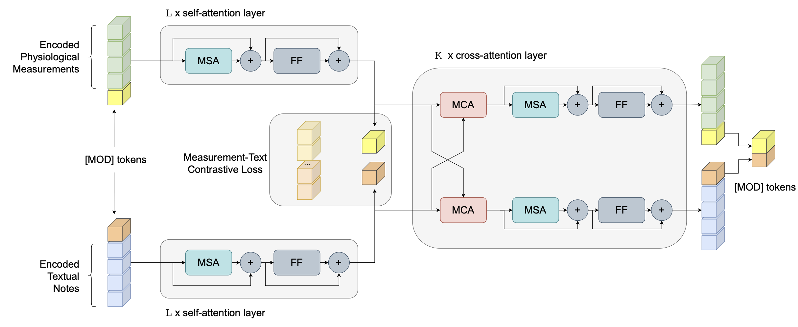

# Multimodal fusion of Electronic Health Record for Clinical Prediction Tasks

This repository contains code for clinical predictions by fusing multimodal Electronic Health Record (EHR) data. We examine two common modalities from EHR data: structured physiological measurements, and unstructured free-text clinical notes; and six prediction tasks: in-ICU/hospital mortality, length-of-stay over 3/7 days, MS/APR-DRG. The model we used is denoted as **A**ttention-based c**R**oss-**MO**dal f**U**sion with cont**R**ast (ARMOUR), which leverages Transformer attention layers and cross-modal contrastive alignment to achieve better fusion results. By using a modality-specific [MOD] token, ARMOUR can accommodate cases/samples with missing modality in the input by using [MOD] representation as a proxy. We examine ARMOUR in two experimental regimes that include or exclude cases with missing modality. 



## 0. Setup env

We run all our experiments with `python==3.8.12` and the main packages are:

```
numpy==1.21.4
pandas==1.3.4
scikit-learn==1.0.1
torch==1.10.0
pytorch-lightning==1.5.4
```

## 1. Prepare Data

### 1.1 Cohort extraction

Scripts used to extract cohorts are in the folder `data/cohort`. For risk stratification tasks, we used the cohort from MIMIC-Extract, where we retrieved the `statics` table from their released `all_hourly_data.h5` file. For the DRG tasks, we queried MIMIC-III on BigQuery using the provided SQL: `cohort-ms-drg.sql` and `cohort-apr-drg.sql`. Then `clean-cohort.ipynb` can be used to clean the cohorts and obtain train/val/test splits. We followed MIMIC-Extract to handle the cohort for the four risk prediction tasks. 

### 1.2 Input data extraction

The below scripts extract the input measurements and notes for the cohorts. They require  `all_hourly_data.h5` from MIMIC-Extract and `NOTEEVENTS.csv.gz` from the MIMIC-III database. You can change the flags in shell scripts accordingly. 

```sh
cd data
# extract data for risk pred
bash prepare_data_risk.sh 

# extract data for drg
bash prepare_data_drg.sh 
```

With the raw cohort and data, `trim-cohort.ipynb` can be used to obtain the cohort variation where all cases have both modalities available. 

### 1.3 Encode clinical notes

Finally, we encoded clinical notes using [CLS] tokens of ClinicalBERT, which are obtained by running the script below. Notice it requires GPU for running BERT, and you may adjust the batch size according to your device.

```sh
# this require gpu 
bash encode_text.sh 
```


## 2. Evaluating checkpoints 

We provide the model checkpoints for the six tasks, trained under two data regimes that either exclude or include cases with missing input modality. Below are the example for in-hospital mortality prediction under two evaluation setups. The script will load the pytorch-lightning checkpoint that can be downloaded from [gdrive](https://drive.google.com/drive/folders/1-0WQy04lwVOlqtrcEVLvLfOsByIOfdgL?usp=sharing), and print out model hyperparameters and evaluation scores. Options for other tasks can be found in `src/options.py`. 

```sh
# cohort w/o missing modality
python src/evaluate.py --task mort_hosp -T --load_ckpt /path/to/cohortWithoutMM/mort_hosp/0.912.ckpt

## this should print out the following
# Results on TEST SET (4732 cases)
# Eval results
# AUCROC  AUCPR   F1      ACC
# 0.912   0.621   0.481   0.928


# cohort w/ missing modality
python src/evaluate.py --task mort_hosp --load_ckpt /path/to/cohortWithMM/mort_hosp/0.915.ckpt

## this should print out the following
# Results on TEST SET (4790 cases)
# Eval results
# AUCROC  AUCPR   F1      ACC
# 0.915   0.645   0.582   0.916

```


## 3. Training from scratch

You can also train the model from scratch and you can add other functions, eg, making inferences and saving intermediate models, using the example script. Below is an example to train the model for in-hospital mortality prediction on cohort without missing modality (trimmed) using the tuned hyperparameters. These hyperparameters are available through the provided checkpoints (see last section).

```sh

python src/run.py \
    --task mort_hosp -T \
    --note_encode_name ClinicalBERT \
    --modality both \
    --dropout 0.2 \
    --wd 0.0001 \
    --num_attention_heads 4 \
    --intermediate_multiplier 2 \
    --ts_size 64 \
    --dropout_grud 0.6 \
    -C --queue_size 8000 \
    --contrast_embed_dim 128 \
    --temp 0.075 \
    --alpha 0.5
```


